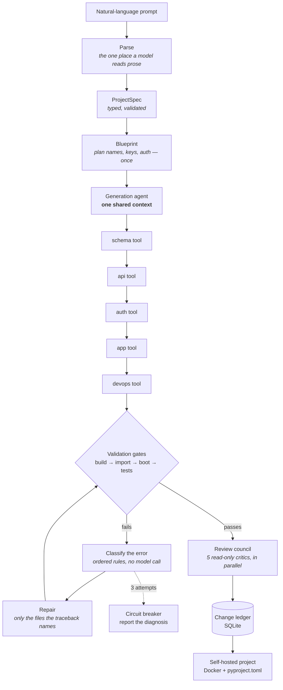

# VibeStack

**An architecture-aware AI software engineering harness** that turns a natural-language
prompt into a runnable, containerized **FastAPI** backend — then *proves it builds*,
*fixes itself* when it doesn't, and *records the rationale* behind every file.

> **Status:** Phases 0–4 complete. VibeStack generates a FastAPI backend, **proves it works**
> behind validation gates, **repairs it automatically** when one fails, **reviews it** from
> five perspectives, and **explains every change** in a persistent audit trail — through a
> CLI or a web UI. Benchmarked at 10/10 on a diverse spec suite.
> See [`docs/ARCHITECTURE.md`](docs/ARCHITECTURE.md) for why it is built this way.

## The problem

Mainstream AI app builders (Lovable, Bolt.new, v0) are locked to JavaScript/TypeScript,
cloud-hosted, and export nothing you can own. Meanwhile AI-generated code is routinely
merged without anyone understanding *why* it looks the way it does — causing architectural
drift and hidden technical debt.

## What VibeStack does

Type *"a blog API with users, posts, comments and JWT auth"* and get back a complete
FastAPI project that:

- **Provably builds and boots** — validated inside a Docker sandbox (import → boot → tests).
- **Self-heals** — if a build gate fails, it classifies the error, patches it, and retries,
  bounded to 3 attempts by a circuit breaker so it never loops forever.
- **Explains itself** — every change is recorded in a SQLite **change ledger** with its
  rationale and impact.
- **Is yours** — delivered as a standard Docker + `pyproject.toml` workspace. Self-hosted,
  no vendor lock-in.

## Architecture

One agent owns a single shared `GenerationState` and calls its tools in dependency order.
The only feedback loop is the bounded self-healing cycle, and the only parallel work is the
read-only review council.



Two deliberate design decisions (both detailed in the plan):

- **No LangGraph.** The flow is a deterministic pipeline plus a bounded retry loop, so an
  explicit Python orchestrator is simpler and fully explainable.
- **Single agent with tools, not multi-agent.** Backend generation has tightly dependent
  outputs (schema → API → auth), which is the wrong fit for multi-agent systems that
  fragment context. Read-only parallelism is reserved for the review council.

## Tech stack

Python 3.11 · FastAPI · Pydantic v2 · instructor · LiteLLM (OpenRouter) · Jinja2 ·
SQLAlchemy · Alembic · Docker · pytest · UV

## Getting started

```bash
# 1. Install (editable, with dev dependencies for the test suite)
pip install -e ".[dev]"

# 2. Configure your model access
cp .env.example .env        # then add your OpenRouter API key to .env

# 3. Generate a backend from a natural-language prompt
python -m vibestack "a blog API with users, posts and JWT auth" --out ./generated-backend

# 4. Run the tests (no API key or network required)
python -m pytest
```

**No API key?** Generation itself is deterministic and needs no model access — you can
generate straight from a specification file:

```bash
python -m vibestack --from-spec examples/blog_api.json --out ./generated-backend
cd generated-backend && docker compose up --build
```

Add `--spec-only` to print the `ProjectSpec` as JSON without generating files.

### Where the language model is used

The model is used for the two jobs it is genuinely better at: reading informal prose and
turning it into a structured `ProjectSpec`, and diagnosing a build failure well enough to
repair it. Code generation itself is deterministic and template-driven, so the same spec
always produces the same files, generation costs nothing, and every output is unit-testable.

## Validation and self-healing

Every generated project is built and run before you get it. Three gates run in order,
cheapest first:

| Gate | What it proves |
|---|---|
| `import` | Every module imports — no syntax errors, no missing names |
| `boot` | The app starts, creates its tables, and answers `/health` |
| `tests` | The generated test suite passes |

With Docker the image is built first, so a broken Dockerfile or an invented dependency is
caught too. When a gate fails, the loop:

1. **classifies** the error against a deterministic taxonomy (missing dependency, undefined
   name, database error, test failure, …) — no model call, so it is free and testable;
2. sends **only the files the traceback names**, plus repair guidance for that category, to
   the model;
3. applies the patch, records it in the ledger, and **re-validates**.

A **circuit breaker** caps this at 3 attempts. If the project still fails, VibeStack stops
and prints the category, the failing gate, and the log — it never loops indefinitely, and it
never hides a failure.

```bash
python -m vibestack --from-spec examples/blog_api.json --sandbox docker      # isolated
python -m vibestack --from-spec examples/blog_api.json --sandbox subprocess  # fast
python -m vibestack --from-spec examples/blog_api.json --no-validate         # skip
```

Validation runs without an API key — you just get a diagnosis instead of a repair.

## Web UI and API

```bash
uvicorn vibestack.api:create_app --factory --reload
```

Open <http://localhost:8000> to generate a backend from the browser, watch it validate and
heal live, read the change ledger, and download the project. Interactive API docs are at
`/docs`. The page ships with a built-in example spec, so the whole demo runs with **no API
key**.

| Endpoint | Purpose |
|---|---|
| `POST /api/generate` | Start a generation from a prompt or a spec |
| `GET /api/jobs/{id}` | Job status and live progress |
| `GET /api/jobs/{id}/ledger` | **The audit trail** — every file and why it exists |
| `GET /api/jobs/{id}/review` | What the review council found |
| `GET /api/jobs/{id}/download` | The project as a zip |

## The change ledger

Every file carries a recorded reason, every automatic repair says what it fixed, and the
whole trail is persisted to SQLite so it outlives the process:

```
[plan    ] (specification)      Added 'password_hash' to User to store passwords.
[schema  ] app/models/user.py   Defines the users table so User records can be stored.
[api     ] app/schemas/user.py  Validates User requests, keeping internal columns out of the API.
[self-heal] app/models/post.py  undefined_name: restored the missing Text import.
```

## Benchmark

Ten diverse specifications — with and without authentication, with relationships, with
CamelCase names, and with deliberate defects — are generated and put through the real
validation gates:

```bash
python -m vibestack.benchmark
```

| Metric | Result |
|---|---|
| Specifications passing every gate | **10 / 10 (100%)** |
| Average generation + validation time | **~2.5 s** |
| Average files per project | **~23** |
| Repairs needed | 0 |

Generation is deterministic, so this benchmark needs no API key and returns the same numbers
every run. Full results: [`docs/BENCHMARK.md`](docs/BENCHMARK.md).

The benchmark earns its keep. It caught a real bug during development: authentication was
being silently skipped whenever the account entity was not literally named `User` — so
`Customer`, `Attendee`, and `Chef` all lost their auth routes. Detection now matches on
shape (does the entity carry a login field?) rather than vocabulary, and there is a
regression test for it.

## The review council

After a project passes its gates, five independent reviewers — architecture, security,
testing, performance, maintainability — read it **in parallel** and report findings by
severity. This is the one place VibeStack runs work concurrently, and the exception is
deliberate: reviewing finished code is genuinely independent work, unlike generation. The
reviewers are read-only, findings that name a file which does not exist are discarded, and
one failing reviewer never discards the other four.

## Roadmap

| Phase | Goal | Status |
|---|---|---|
| P0 | Skeleton — spec parsing + CLI | ✅ Done |
| P1 | Happy-path generation (CRUD + auth) | ✅ Done |
| P2 | Docker validation + self-healing loop | ✅ Done |
| P3 | Change ledger + review council + API | ✅ Done |
| P4 | Polish, benchmark, demo | ✅ Done |

See [`docs/PROJECT_PLAN.md`](docs/PROJECT_PLAN.md) for the full detail, component choices,
and team task board.

## Documentation

| Document | What is in it |
|---|---|
| [`docs/ARCHITECTURE.md`](docs/ARCHITECTURE.md) | **Why the system is built this way** — the design decisions and their reasoning |
| [`docs/PROJECT_PLAN.md`](docs/PROJECT_PLAN.md) | Roadmap, component choices, risk register |
| [`docs/BENCHMARK.md`](docs/BENCHMARK.md) | Full benchmark results, regenerated by the runner |
| [`docs/DEMO.md`](docs/DEMO.md) | A ten-minute demo walkthrough that needs no API key |

## Development

```bash
pip install -e ".[dev]"
python -m pytest                    # 113 tests, no network needed
python -m vibestack.benchmark       # regenerate the benchmark numbers
```

## Project

Final-year project — B.Tech CSE (Artificial Intelligence), Muthoot Institute of Technology
and Science (Autonomous), Kochi.

**Team:** Reuben Sabu V · Sidharth Ravi · Jino Jenz · Nikhil Jimmy &nbsp;·&nbsp; **Guide:** Nimmi M K

## License

MIT — see [LICENSE](LICENSE). The code VibeStack generates is yours, with no restrictions.
