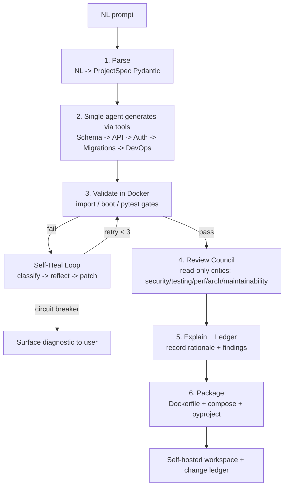

# VibeStack — Architecture & Execution Plan

> Architecture-Aware AI Software Engineering Harness that turns a natural-language
> prompt into a runnable, containerized **FastAPI** backend — with an agentic
> **self-healing** build loop, a **change ledger** that records the *why* behind every
> file, and a multi-perspective **review council**. Self-hosted, zero vendor lock-in.

---

## 1. Context — why we are building this

**The problem.** Every mainstream "vibe coding" app builder (Lovable, Bolt.new, v0) is
locked to JavaScript/TypeScript and is cloud-hosted with proprietary export. Python's
large backend developer base is effectively excluded, and users cannot own, self-host,
or audit the generated code. Separately, AI-generated code is merged without anyone
understanding *why* it looks the way it does — causing architectural drift and hidden
technical debt.

**Our outcome.** A self-hosted tool where a developer types *"a blog API with users,
posts, comments and JWT auth"* and receives a complete FastAPI project that **actually
builds and boots** (proven inside Docker), together with a plain-English **change ledger**
explaining every decision. If the generated code fails to build, the system **diagnoses
and fixes itself** (bounded to 3 attempts).

**Two goals this plan serves at once:**
1. **College final-year project** (team of 4: Reuben, Sidharth, Jino, Nikhil; Guide: Nimmi M K).
2. **Placement portfolio piece** for Infosys **SP(L3)** technical-depth rounds and **IBM AI/GenAI (~₹12 LPA)** roles, which hire on *deployed AI portfolios*.

> **Honest placement note:** Infosys SP is tiered — **SP L1 ₹10 / L2 ₹16 / L3 ₹21 LPA** —
> and is gated primarily by **DSA + competitive-programming assessments** (2 rounds:
> 3-hr online + 3-hr in-person via HackWithInfy/InfyTQ). VibeStack is your weapon for the
> **interview/technical-depth + HR rounds**, *not* a substitute for grinding DSA. For
> **IBM AI/GenAI**, VibeStack is close to an ideal portfolio project (LLMs, RAG-style memory,
> vector DB optional, live deployment).

---

## 2. Key decisions (confirmed with you)

| Decision | Choice | Rationale |
|---|---|---|
| Product scope | **Unified** — generator **+** architecture-aware governance | Matches both documents; most differentiated pitch. Phased: generator first, governance layered on. |
| Orchestration | **Plain Python orchestrator** (no LangGraph) | Our flow is a *deterministic* pipeline + a *bounded* retry loop → LangGraph's dynamic-graph value doesn't apply. Every line is explainable in an interview. |
| **Agent topology** | **Single agent + many tools** (not master/sub-agent) | Backend generation has *tightly dependent outputs* (schema→API→auth→migrations). Both Cognition and Anthropic say that is the *wrong* case for multi-agent. See §2.2. |
| LLM access | **LiteLLM + OpenRouter** | One key, 200+ models, trivial tiered routing + fallback, <$0.05/generation. |
| Pitch target | **Whole system** | Nikhil owns the integrating spine (orchestrator + API server) for end-to-end fluency. |

### 2.1 The LangGraph verdict (your explicit question), for the pitch
> "We evaluated **LangGraph**, but our control flow is a **deterministic pipeline**
> (Parse → Generate → Validate → Package) wrapped in a **bounded self-healing loop**
> (max 3 retries with a circuit breaker). LangGraph's strength — dynamic, non-prespecified
> branching over a graph — doesn't apply here, and it adds abstraction layers that hurt
> readability and debuggability. We chose an **explicit Python orchestrator with a single
> typed state object**, so control flow is obvious and every decision is traceable."

That answer *demonstrates judgment* — stronger at SP level than name-dropping a framework.
We keep checkpointing (the one genuinely useful LangGraph feature) by **serializing our
state object to disk after each stage** — ~15 lines, fully explainable.

### 2.2 Single agent vs multi-agent — your doubt, investigated

**Your instinct is correct for this problem.** You argued a single agent with many tool
calls beats a master/sub-agent design because multi-agent setups "devolve into context
issues." The evidence backs you — with one precise exception (the review council).

**What the two authoritative camps actually say:**
- **Cognition — *"Don't Build Multi-Agents"* (Devin team, 2025):** naive multi-agent
  setups fracture context and compound errors, because **sub-agents have no view of each
  other's work**, so they make conflicting decisions. Their rule: *actions carry implicit
  decisions, and conflicting decisions produce bad results* → keep **one continuous context**.
- **Anthropic — *multi-agent research system* (2025):** multi-agent beat single-agent by
  ~90% **but only** on **breadth-first, read-only search** where subtasks are *independent*.
  They state the limit plainly: *"domains that require all agents to share the same context,
  or that involve many dependencies between agents, are not a good fit for multi-agent
  systems,"* and it costs **~15× the tokens**.

**Apply that test to VibeStack.** Backend generation is the textbook *dependency-heavy,
shared-context* case: the schema constrains the API, which constrains auth, which constrains
migrations. That is **exactly** what Anthropic says to *avoid* for multi-agent, and exactly
the fragmentation Cognition warns about. Worse, a fragmented multi-agent generator would
*re-introduce the "global consistency problem" VibeStack exists to solve.* So:

> **Decision: a single agent owns one continuous context and calls tools**
> (`read_file`, `write_file`, `patch_code`, `run_tests`, `inspect_schema`). The
> "Schema Designer / API Generator / Auth Engineer" from the report become **sequential
> tools/skills the one agent invokes**, not autonomous sub-agents. Bonus: this also
> kills the ~15× multi-agent token tax — directly serving our <$0.05/generation goal.

**The one deliberate exception — the review council (read-only).** Reviewing a *finished*
codebase from 5 lenses (security, testing, performance, architecture, maintainability) *is*
the Anthropic sweet spot: independent, read-only, breadth-first, each returning a compressed
summary. So the council runs as **ephemeral read-only critics whose summaries the single
orchestrator merges** — they never write code or coordinate. This mirrors the **2026 settled
consensus**: *one orchestrator owns continuous context and spawns ephemeral, read-only
sub-tasks that return compressed summaries.*

**The pitch line (rehearse this — it reads as senior-level judgment):**
> "We use a **single-agent-with-tools** core, not a multi-agent orchestra. Our generation
> task is dependency-heavy — the schema drives the API drives auth — which is precisely the
> case Cognition and Anthropic both say multi-agent handles *badly*, because sub-agents lose
> shared context and produce inconsistent code. We reserve limited, **read-only** parallelism
> for the review council alone, where the perspectives are genuinely independent. That's the
> 2026 consensus, and it also saves us the ~15× token cost of a multi-agent write path."

---

## 3. System architecture

### 3.1 High-level pipeline



The **single agent** owns one context and calls tools left-to-right (§2.2). Two feedback
loops wrap it: the **Self-Healing Loop** (retry on build failure) and the **Memory Loop**
(the typed state object + change ledger carried across every step). The **council runs after
a green build** as independent read-only critics — the only place we use parallelism.

### 3.2 One agent, one shared context (the spine)
There is **one reasoning thread** (the orchestrator) that owns a single `GenerationState`
Pydantic model — no hidden globals, no sub-agents with private context windows. State
carries: `spec`, `generated_files: dict[str, str]`, `build_status`, `error_log`,
`heal_attempts`, `ledger_entries`. This is our "memory," our checkpoint unit, **and** the
shared context that keeps generated files consistent (per §2.2). The specialist "roles"
(schema, API, auth, devops) are **tools this one agent calls in sequence**, each reading the
same state — not independent agents.

### 3.3 Components (each = one small, well-named module)

| Component | Technology | Responsibility | Alternative considered |
|---|---|---|---|
| NL Parser | **instructor + Pydantic v2** over LiteLLM | NL → schema-valid `ProjectSpec` (guaranteed JSON, auto-retry) | Hand-parsing JSON (fragile) |
| Orchestrator (the one agent) | **Plain Python** (functions + one loop) | Own continuous context; call tools in order; run the self-heal loop | LangGraph / multi-agent (both rejected, §2.1–2.2) |
| Review Council | LLM read-only critics (parallel) | Score the *finished* code on 5 lenses; summaries merged by orchestrator | Skip (loses "architecture-aware" story) |
| Schema tool | LLM + **Jinja2** | SQLAlchemy models, relationships, indexes | Separate sub-agent (context fragmentation) |
| API tool | LLM + Jinja2 | FastAPI routers + Pydantic request/response schemas | — |
| Auth tool | Jinja2 templates + LLM | JWT register/login/me, bcrypt hashing | — |
| Migration Gen | **Alembic** (autogenerate) | Versioned DB schema | Manual SQL (not reproducible) |
| DevOps Packager | Jinja2 | Dockerfile (multi-stage) + docker-compose + pyproject.toml | — |
| Sandbox + Validator | **Docker** (SDK/subprocess) + **pytest** | 3 gates: import / boot / functional | Run on host (unsafe) |
| Reflector | LLM (cheap model) | Classify build error → propose patch | — |
| Change Ledger | **SQLite** | Record file, rationale, impact, timestamp per change | JSON file (less queryable) |
| LLM Client | **LiteLLM + OpenRouter** | Tiered routing + model fallback | Single-provider SDK |
| Tool API/UI | **FastAPI** + one static HTML page | `POST /generate`, status, ledger, download | CLI-only (weaker demo) |

### 3.4 FastAPI plays two roles
1. **Target of generation** — the tool *emits* FastAPI backends.
2. **The tool's own server** — `POST /generate`, `GET /jobs/{id}`, `GET /jobs/{id}/ledger`,
   `GET /jobs/{id}/download`, plus a thin HTML page for the live demo. A CLI
   (`python -m vibestack "..."`) wraps the same core for scripted use.

### 3.5 Self-healing loop (the headline feature)
```
attempt = 0
while attempt < MAX_HEAL_ATTEMPTS:      # MAX = 3 (circuit breaker)
    result = validate_in_docker(state)  # import -> boot -> pytest
    if result.passed:
        return state
    error_category = classify_error(result.logs)   # dependency / type / auth / ...
    patch = reflect_and_patch(state, error_category, result.logs)
    state = apply_patch(state, patch)
    record_ledger(state, "self-heal", why=error_category)
    attempt += 1
return surface_diagnostic(state)        # transparent failure, no infinite loop
```
Resilience layers, in priority order: **Retry w/ backoff** (transient) → **Model fallback**
(LiteLLM swaps model) → **Error classification + reflection** → **Checkpoint recovery**
(reload last good state object).

### 3.6 Tiered model routing (cost control, via LiteLLM)
Cheap model → error classification & formatting; mid model → routine codegen; premium
model → architecture design & complex reflection. Model *names live in config* (they
change monthly) so we never hardcode them.

---

## 4. Repository layout (the VibeStack tool itself)

```
vibestack/
├── pyproject.toml                # UV-managed deps + tool config
├── README.md                     # architecture diagram + quickstart
├── .env.example                  # OPENROUTER_API_KEY, model tiers
├── vibestack/
│   ├── __init__.py
│   ├── __main__.py               # CLI entry: python -m vibestack "..."
│   ├── config.py                 # settings (Pydantic BaseSettings)
│   ├── state.py                  # GenerationState (the spine)
│   ├── spec.py                   # ProjectSpec + Entity/Field/Auth models
│   ├── llm_client.py             # LiteLLM wrapper + tiered routing + fallback
│   ├── orchestrator.py           # runs stages; owns the self-heal loop
│   ├── stages/
│   │   ├── parse.py              # NL -> ProjectSpec (instructor)
│   │   ├── council.py            # 5-lens review
│   │   ├── generate.py           # schema/api/auth/migration/devops
│   │   ├── validate.py           # Docker sandbox: 3 gates
│   │   └── reflect.py            # classify + patch
│   ├── ledger.py                 # SQLite change ledger + explanations
│   ├── templates/                # Jinja2 templates for generated code
│   └── api.py                    # FastAPI server + static demo page
└── tests/                        # pytest for the tool itself
```

---

## 5. Coding standards (non-negotiable — this is your pitch moat)

Optimize for *explaining the code out loud in an interview*:
- **Type hints on every function** signature and return.
- **Small, single-purpose functions**; descriptive names (`classify_build_error`, not `cbe`).
- **Docstrings** stating what + why on every public function/class.
- **Pydantic models over dict-soup** for all structured data.
- **Early returns** over deep nesting; **guard clauses** at the top.
- **No clever one-liners:** avoid nested comprehensions, walrus (`:=`) golf, metaclasses,
  `functools.reduce`, monkey-patching. A readable `for` loop beats a dense comprehension.
- **Comments explain *why*, not *what*.**
- Constants (`MAX_HEAL_ATTEMPTS = 3`) named at module top, never magic numbers inline.

---

## 6. Execution roadmap (MVP-first, realistic around placements)

| Phase | Goal | Deliverable / exit criteria | Owner (suggested) |
|---|---|---|---|
| **P0 — Skeleton** | Repo boots | `pyproject.toml`, config, `GenerationState`, `ProjectSpec`, LiteLLM client returns text; `python -m vibestack` runs | Nikhil (spine) |
| **P1 — Happy-path gen** | NL → files on disk | Parse → generate FastAPI CRUD + SQLAlchemy + JWT via Jinja2+LLM; writes a project folder that a human can `uvicorn` | Person B + Nikhil |
| **P2 — Validate + self-heal** | It actually builds | Docker 3-gate validation + self-heal loop + circuit breaker; `>80%` build success on 10 sample prompts | Person C |
| **P3 — Governance layer** | "Architecture-aware" | SQLite change ledger + plain-English explanations + 5-lens council; `GET /ledger` shows the audit trail | Person D |
| **P4 — Polish & demo** | Pitchable | FastAPI UI, README + diagram, demo video, tiered routing + fallback, benchmark table | All |

**Stretch (only if time):** Alembic autogenerate (likely include — cheap + impressive),
ChromaDB L2 semantic memory, MCP servers (Postgres/Docker/GitHub), Trivy/Checkov security
scan, Java/Spring Boot prototype. **Do not build these before P0–P3 are solid.**

### 6.1 Suggested module ownership (4 people)
- **Nikhil** — `orchestrator.py`, `state.py`, `api.py` (the spine → whole-system pitch fluency).
- **Person B** — `stages/generate.py` + `templates/`.
- **Person C** — `stages/validate.py` + `stages/reflect.py` (Docker + self-heal).
- **Person D** — `ledger.py` + `stages/council.py` + demo UI.

---

## 7. The pitch (whole-system, ~90 seconds)

**Hook:** "AI code tools generate fast but leave you with code nobody understands and that
often doesn't even run. VibeStack turns a plain-English request into a FastAPI backend that
**provably builds**, **fixes itself** when it doesn't, and **explains every decision** — all
self-hosted, so you own the code."

**Architecture in one breath:** "A deterministic Python pipeline — parse to a typed spec,
generate each layer, then validate the whole thing inside a Docker sandbox. If a build gate
fails, a self-healing loop classifies the error, patches it, and retries, capped at three
attempts by a circuit breaker so it can never burn tokens in a loop."

**Three things that make it novel:** (1) **architecture-aware single-agent generation** — one
shared context keeps files globally consistent, deliberately avoiding multi-agent
fragmentation; (2) **production-grade self-healing** with tiered model routing and a hard cost
ceiling; (3) a **change ledger** — every AI edit is recorded with its rationale and impact, so
the code is auditable.

**Two engineering-judgment lines (rehearse both — this is what separates SP-level candidates):**
the "why not LangGraph" answer (§2.1) and the "single-agent-with-tools, not multi-agent" answer
(§2.2). Each shows you can *reject* a trendy pattern with a reason, which recruiters weight far
higher than listing buzzwords.

**Metrics to quote:** >90% build success target, <$0.05/generation, <2.5 self-heal iterations,
<60s per backend. (Fill with real numbers from your P2 benchmark.)

**Tailoring:** *IBM AI/GenAI* → lead with the LLM pipeline, structured outputs, self-healing,
and live Docker deployment. *Infosys SP technical round* → lead with the explicit orchestrator,
the typed state machine, and clean DSA-style reasoning in the self-heal classifier.

---

## 8. Verification (how we prove it works end-to-end)

1. **Unit/tool tests:** `pytest` in the VibeStack repo (parser returns valid `ProjectSpec`,
   ledger writes/reads, error classifier maps known logs to categories).
2. **CLI smoke test:** `python -m vibestack "a blog API with users, posts, comments, JWT auth"`
   → produces `generated-backend/`.
3. **Generated-project proof:** `cd generated-backend && docker compose up` → server boots,
   `GET /health` returns 200, `pytest` (auto-generated) passes.
4. **Self-heal proof:** inject a known break (e.g., missing import) into a template, confirm the
   loop detects → fixes → re-validates, and that 3 hard failures trip the circuit breaker.
5. **Governance proof:** `GET /jobs/{id}/ledger` returns a readable list of changes with
   rationale; explanations render on the demo page.
6. **Benchmark:** run 10–50 sample prompts, record build-success %, avg cost, avg iterations →
   the table for the report and the pitch.

---

## 9. First implementation step (when you say go)

Scaffold **P0**: create `pyproject.toml` (UV), `vibestack/config.py`, `vibestack/state.py`,
`vibestack/spec.py`, `vibestack/llm_client.py` (LiteLLM call + tiered config), and a
`python -m vibestack` entry that parses a prompt into a `ProjectSpec` and prints it. Commit to
`claude/infosys-sp-l3-design-dlbr0q`. That single commit already demonstrates the spine +
structured-output parsing — the foundation everything else hangs off.

---

## Appendix A — Key data models & orchestrator skeleton

These are the load-bearing types and the main loop, written to the readability bar from §5
(type hints, docstrings, no clever shortcuts). They double as starter code *and* pitch material.

### A.1 `spec.py` — the structured request (single source of truth)
```python
from enum import Enum
from pydantic import BaseModel


class FieldType(str, Enum):
    """The column types VibeStack knows how to generate."""
    INTEGER = "int"
    STRING = "str"
    BOOLEAN = "bool"
    DATETIME = "datetime"
    TEXT = "text"
    FLOAT = "float"


class EntityField(BaseModel):
    """One column on a database table."""
    name: str
    type: FieldType
    primary_key: bool = False
    unique: bool = False
    nullable: bool = True


class RelationshipType(str, Enum):
    ONE_TO_MANY = "one_to_many"
    MANY_TO_ONE = "many_to_one"
    MANY_TO_MANY = "many_to_many"


class Relationship(BaseModel):
    """A link from one entity to another."""
    target_entity: str
    type: RelationshipType
    back_populates: str


class Entity(BaseModel):
    """A single database table and its matching API resource."""
    name: str
    fields: list[EntityField]
    relationships: list[Relationship] = []


class AuthConfig(BaseModel):
    """How authentication should be scaffolded."""
    enabled: bool = True
    strategy: str = "jwt"                       # jwt today; oauth2 later
    endpoints: list[str] = ["register", "login", "me"]


class ProjectSpec(BaseModel):
    """
    The structured intermediate representation of the user's request.
    The NL parser fills this in once; every downstream stage only reads it.
    Because it is a Pydantic model, `instructor` can force the LLM to
    return JSON that matches it exactly.
    """
    project_name: str
    description: str
    entities: list[Entity]
    auth: AuthConfig = AuthConfig()
    features: list[str] = []                    # e.g. "pagination", "search"
```

### A.2 `state.py` — the spine that flows through every stage
```python
from pydantic import BaseModel
from vibestack.spec import ProjectSpec


class LedgerEntry(BaseModel):
    """One recorded change, for the audit trail (the 'why')."""
    stage: str                                  # "generate", "self-heal", ...
    file_path: str
    rationale: str                              # plain-English reason
    timestamp: str


class GenerationState(BaseModel):
    """
    The single object passed through the whole pipeline. Created once,
    updated by each stage. Also our checkpoint unit: we serialize it to
    disk after each stage so a crash can resume from the last good point.
    """
    spec: ProjectSpec
    generated_files: dict[str, str] = {}        # file path -> file contents
    build_passed: bool = False
    error_log: str = ""
    heal_attempts: int = 0
    ledger: list[LedgerEntry] = []
```

### A.3 `orchestrator.py` — the whole system in two readable functions
```python
MAX_HEAL_ATTEMPTS = 3        # circuit breaker: the loop can never run forever


def run_pipeline(prompt: str) -> GenerationState:
    """
    Turn a natural-language prompt into a validated backend.
    One agent, one state object, tools called in order. Reads
    top-to-bottom on purpose: this function IS the architecture.
    """
    spec = parse_prompt_to_spec(prompt)         # stage 1: NL -> ProjectSpec
    state = GenerationState(spec=spec)

    state = generate_all_files(state)           # stage 2: agent calls schema/api/auth tools
    save_checkpoint(state)

    state = validate_and_heal(state)            # stage 3 + self-heal loop
    state = run_review_council(state)           # stage 4: read-only critics (parallel, §2.2)
    write_explanations(state)                   # stage 5: ledger -> English
    package_workspace(state)                    # stage 6: Docker + pyproject
    return state


def validate_and_heal(state: GenerationState) -> GenerationState:
    """
    Build the project inside a Docker sandbox. If a gate fails, classify
    the error, patch it, record why, and retry — up to MAX_HEAL_ATTEMPTS.
    """
    while state.heal_attempts < MAX_HEAL_ATTEMPTS:
        result = validate_in_docker(state)      # import -> boot -> pytest
        if result.passed:
            state.build_passed = True
            return state

        # The build failed. Diagnose, patch, log, and try again.
        category = classify_build_error(result.logs)
        state = apply_reflection_patch(state, category, result.logs)
        state.ledger.append(make_ledger_entry("self-heal", category))
        state.heal_attempts += 1
        save_checkpoint(state)

    # Circuit breaker tripped: fail loudly and transparently, never silently.
    state.error_log = summarize_diagnostic(state)
    return state
```

> Note how the "orchestration" a beginner might reach for LangGraph to do is just a
> `while` loop with a named limit. Anyone can read it; you can defend every line.

---

## Appendix B — Recruiter / interview Q&A bank

Rehearse these out loud. Short, confident, reason-first answers. (SP = Infosys Specialist
Programmer technical round; AI = IBM AI/GenAI round.)

**Q1. Why not use LangGraph / an agent framework? (SP, AI)**
Our control flow is a deterministic pipeline wrapped in a bounded retry loop — no dynamic
graph branching to model. LangGraph would add abstraction layers that hurt readability and
debuggability for zero benefit here. We used an explicit orchestrator with one typed state
object; we kept the one useful idea (checkpointing) as a 15-line "serialize state to disk."

**Q2. Single agent or multi-agent? Why? (SP, AI)**
Single agent with many tools. Backend generation has tightly dependent outputs — the schema
drives the API drives auth drives migrations. Both Cognition ("Don't Build Multi-Agents") and
Anthropic's own multi-agent paper say dependency-heavy, shared-context tasks are the *wrong*
fit for multi-agent, because sub-agents lose each other's context and produce inconsistent
code. We only use read-only parallelism for the review council, where perspectives are
independent. It's also ~15× cheaper on tokens than a multi-agent write path.

**Q3. How do you keep the generated files consistent with each other? (AI)**
One shared context. Every tool reads and writes the same `GenerationState`, which holds the
`ProjectSpec` (single source of truth) and all files generated so far. The API tool sees the
exact models the schema tool produced, so it can't invent mismatched fields.

**Q4. How does the self-healing loop avoid infinite loops and runaway cost? (SP, AI)**
A circuit breaker: `while heal_attempts < MAX_HEAL_ATTEMPTS` (3). Each failed build is
classified, patched, and retried; after 3 failures we stop and surface a diagnostic instead
of looping. Combined with a hard token budget, cost is bounded and predictable.

**Q5. How do you safely run AI-generated code you don't trust? (SP, AI)**
We build and run it inside a Docker sandbox — never on the host. The container runs as a
non-root user, with CPU/memory limits, no outbound network during tests, only the generated
project mounted, and it's auto-destroyed after each run. We note the honest limit (containers
share the host kernel) and list gVisor/microVMs (Firecracker) as future hardening.

**Q6. How do you guarantee the LLM returns valid, usable structured output? (AI)**
We use `instructor` + Pydantic v2: the model is constrained to emit JSON matching our schema,
and invalid outputs trigger an automatic re-ask. So the parser hands the rest of the system a
validated Python object, not a string we hope is JSON.

**Q7. What if the model hallucinates a package or writes code that won't compile? (SP, AI)**
That's precisely what the Docker validation gates catch — import test, boot test, pytest. A
failure isn't a crash; it's a signal that feeds the reflector, which classifies the error
(e.g. dependency/type/auth) and patches it. The build process is our objective ground truth.

**Q8. How is this different from GitHub Copilot or Lovable/Bolt? (SP, AI)**
Copilot autocompletes inside one file; Lovable/Bolt scaffold JS/TS apps in the cloud with no
export. We target Python/FastAPI, we *prove the whole project builds* before handing it over,
we *fix it ourselves* when it doesn't, and we ship a self-hosted Docker workspace the user
fully owns — plus a change ledger explaining every decision. (See Appendix C table.)

**Q9. How do you control API cost? (AI)**
Tiered model routing via LiteLLM — cheap models for classification/formatting, a premium
model only for hard reasoning — plus delta-only context (send just the changed files) and the
3-iteration circuit breaker. Target: <$0.05 per generated backend.

**Q10. How do you test a non-deterministic (LLM) system? (SP, AI)**
Two layers. Deterministic unit tests for everything that isn't the LLM (spec validation,
ledger I/O, error classifier on fixed log samples). And an outcome-based benchmark: run 50
prompts, measure build-success %, avg cost, avg heal iterations — we assert on the aggregate,
not on exact tokens.

**Q11. (SP deep-dive) Walk me through a data structure/algorithm in the code.**
The error classifier maps Docker build logs to a fault taxonomy. It's a prioritized rule set
(ordered pattern matches) returning the first category that hits; each category maps to a
targeted reflection prompt. We can discuss the ordering as a decision-list and the trade-off
vs. a learned classifier.

**Q12. What was the hardest part, and what would you change? (SP, AI)**
Hardest: making self-healing *converge* instead of oscillating — solved with error
classification so each retry is targeted, not a blind re-prompt. Next: a learned error
classifier trained on our own build-failure logs, and semantic project memory (ChromaDB) so
the tool reuses fixes across projects.

---

## Appendix C — VibeStack vs the field + academic novelty

### C.1 Comparison table (report-ready)
| Capability | Copilot | Cursor | Lovable / Bolt | Plain ChatGPT | **VibeStack** |
|---|---|---|---|---|---|
| Target language | any (autocomplete) | any | JS/TS only | any (snippets) | **Python / FastAPI (backend-first)** |
| Generates a *whole* runnable project | ✗ | partial | ✓ (JS) | ✗ | **✓** |
| *Proves* the output builds | ✗ | ✗ | ✗ | ✗ | **✓ (Docker gates)** |
| Fixes its own build errors | ✗ | partial | ✗ | ✗ | **✓ (self-heal loop)** |
| Self-hosted / user owns code | ✗ | ✗ | ✗ | ✗ | **✓ (Docker + pyproject)** |
| Explains every change (audit ledger) | ✗ | ✗ | ✗ | ✗ | **✓ (SQLite ledger)** |
| Agent topology | n/a | single | single | single | **single-agent + tools (deliberate)** |

### C.2 Academic novelty (four contributions, updated for single-agent design)
1. **Architecture-aware single-agent generation** — one shared context enforces global
   consistency across schema/API/auth/migrations, avoiding the multi-agent fragmentation that
   both Cognition and Anthropic warn against for dependency-heavy tasks.
2. **Production-grade self-healing with cost control** — a 4-layer resilience stack (retry,
   model fallback, error-classified reflection, checkpoint recovery) with a circuit breaker —
   a *deployable* take on Reflexion, not just a research demo.
3. **Zero-vendor-lock-in delivery** — standard Docker + `pyproject.toml`; runs offline, no
   subscription, no proprietary export.
4. **Explainability via a change ledger** — every AI edit is recorded with rationale and
   impact, making AI-generated code auditable — the "architecture-aware harness" thesis.

> Positioning tip for the report: Gartner predicts ~40% of agentic-AI projects get cancelled
> (often from multi-agent complexity). Your *deliberate choice* of a simpler single-agent
> design is a defensible, cite-able stance — not a limitation.

---

## Appendix D — Risk register & fallback MVP

| # | Risk | Likelihood | Impact | Mitigation |
|---|---|---|---|---|
| R1 | Docker misbehaves during the live demo | Med | High | Pre-record a backup demo video; cache a known-good generation; have `docker compose up` of a pre-generated project ready. |
| R2 | LLM cost or output quality drifts | Med | Med | LiteLLM model fallback chain; tiered routing; cap tokens; keep a local Ollama fallback for offline/zero-cost. |
| R3 | Scope creep vs. 4 months + placements | **High** | High | Strict phase gates (P0→P4); build the fallback MVP (D.1) first; treat ChromaDB/MCP/security-scan/Java as stretch only. |
| R4 | Self-heal loop won't converge | Med | Med | Error classification makes each retry targeted; circuit breaker caps waste; log every attempt for analysis. |
| R5 | Non-reproducible generations block grading | Low | Med | Save the `GenerationState` + prompt + model IDs per run; benchmark on aggregate metrics, not exact output. |
| R6 | Team coordination / uneven load (esp. during Nikhil's interviews) | Med | Med | Clear module ownership (§6.1); the single-agent design means fewer cross-team interface fights than multi-agent would. |
| R7 | Untrusted generated code harms host | Low | High | Sandbox hardening from Appendix B/Q5; never execute on host. |

### D.1 Fallback "must-ship" MVP (if time gets tight)
Ships and still pitches well with only **P0–P2**: NL → FastAPI CRUD + SQLAlchemy + JWT →
Docker validation → self-heal loop → a `generated-backend/` that `docker compose up` boots.
Drop (in order) Java prototype → MCP → ChromaDB → security scan → the parallel council
(replace with a single review pass). The self-healing loop is the non-negotiable headline;
protect it.

---

## Appendix E — Team task board (16 weeks ≈ 4 months)

Phase gates in **bold**. Nikhil owns the spine throughout (and can review-only during
interview weeks, since his modules are the integration glue).

**Weeks 1–2 · P0 Skeleton** — **Gate: `python -m vibestack "..."` prints a `ProjectSpec`.**
- Nikhil: repo, `pyproject.toml` (UV), `config.py`, `state.py`, `llm_client.py` (LiteLLM + tiers), CLI entry.
- B: `spec.py` models + `parse.py` (instructor) with 5 sample prompts.
- C: Docker base image + a throwaway "build this folder" runner spike.
- D: SQLite `ledger.py` schema + write/read + one unit test.

**Weeks 3–6 · P1 Happy-path generation** — **Gate: generated project boots via `uvicorn` by hand.**
- Nikhil: `orchestrator.run_pipeline` wiring; checkpoint save/load.
- B: `generate.py` + Jinja2 templates for models, routers, Pydantic schemas.
- C: Auth tool (JWT register/login/me, bcrypt); Alembic autogenerate.
- D: ledger entries recorded per generated file; DevOps packager (Dockerfile/compose/pyproject).

**Weeks 7–10 · P2 Validate + self-heal** — **Gate: >80% build success on 10 prompts.**
- Nikhil: `validate_and_heal` loop + circuit breaker + model-fallback wiring.
- C: `validate.py` 3 gates in Docker (import/boot/pytest); sandbox hardening (Q5).
- B: `reflect.py` error classifier (fault taxonomy) + targeted reflection prompts.
- D: diagnostic summary surface; benchmark harness (success %, cost, iterations).

**Weeks 11–13 · P3 Governance layer** — **Gate: `GET /jobs/{id}/ledger` shows the audit trail.**
- Nikhil: `api.py` FastAPI server (`/generate`, `/jobs`, `/ledger`, `/download`).
- D: `council.py` read-only parallel critics (5 lenses) → merged findings; plain-English explanations.
- B: thin static HTML demo page.
- C: optional Trivy/Checkov security-scan step (stretch).

**Weeks 14–16 · P4 Polish & launch** — **Gate: demo video + README + benchmark table done.**
- All: README with architecture diagram, benchmark on 50 prompts, demo video, MIT release.
- Stretch only if green: ChromaDB L2 memory, one MCP server, Java/Spring Boot prototype.

> If interview crunch hits weeks 7–13, the fallback MVP (D.1) is the line to hold: P0–P2
> shipped + a recorded demo is enough to pitch and to submit.
